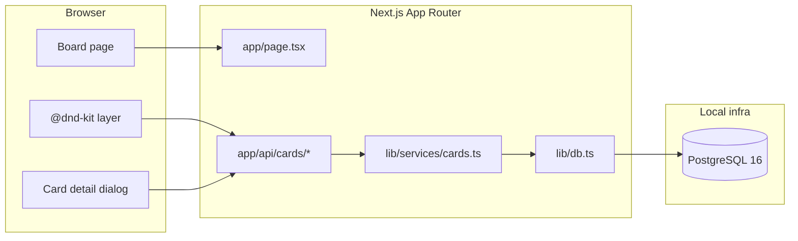

# Tech Spec — App skeleton (full-stack Kanban board)

**AIDLC phase:** Design (one **Unit** per Tech Spec; split only if independently implementable)  
**Grounding:** This document implements the approved **Product Spec** and must **link** to existing **ADRs** instead of re-deriving org-wide architecture.

---

## Overview

| Field | Value |
|-------|-------|
| **Unit / scope** | Greenfield runnable web app: single Kanban board, eight AIDLC columns, card CRUD + move, PostgreSQL persistence, local dev + CI |
| **Feature** | [`feature/app-skeleton/`](.) — [#1 App skeleton (Kanban task manager)](https://github.com/queen-of-code/task-manager/issues/1) |
| **Product Spec** | [`product-spec.md`](product-spec.md) — approved 2026-06-09 (human gate: `/design` invoked on issue #1) |
| **Status** | Approved for build (2026-06-09) |
| **Author** | Melissa Benua (with AI-DLC Design orchestrator) |
| **Created** | 2026-06-09 |
| **Last updated** | 2026-06-09 |

## Context

### Summary

Bootstrap the **task-manager** application as a **Next.js 16 full-stack monolith**: one page renders a horizontal Kanban board with eight fixed AIDLC phase columns; cards support GitHub Projects v1–like fields (title, description, labels, assignee placeholder); all state is stored in **PostgreSQL** via **Prisma**; drag-and-drop and keyboard-accessible move actions call REST API routes. Docker Compose provides the database; README documents how to run app + DB locally.

### Existing system & documentation

- **Repo layout / services:** Greenfield — no app code yet. Process scaffolding only (`docs/`, `feature/`, `.github/workflows/aidlc-*.yml`). Application code lands at repo root per [ADR-0001](../../adr/0001-nextjs-prisma-postgresql-stack.md).
- **Relevant ADRs:**
  - [ADR-0001 — Next.js + Prisma + PostgreSQL](../../adr/0001-nextjs-prisma-postgresql-stack.md)
  - [ADR-0002 — shadcn/ui + @dnd-kit](../../adr/0002-shadcn-ui-and-dnd-kit.md)
- **Prior art in repo:** None (first application Feature). Follow AI-DLC consumer patterns in `AGENTS.md` for dev URL (`http://127.0.0.1:3000`) and UI validation (`docs/INTERACTIVE-UI-VALIDATION.md`).

### Out of scope for this Unit

- Authentication, multi-user, tenants, RBAC
- Multiple boards / project picker
- GitHub Issues or Projects v2 sync
- Comments, notifications, webhooks, milestones
- Production deployment, hosting, TLS, backups
- Mobile-optimized layout
- Custom or user-defined columns
- Real assignee identity (avatars link to auth — placeholder string/initials only)

## Architecture

### High-level design

Single **Unit** — no sub-issue split. All work ships in one PR (`Closes #1`).



**Layer responsibilities**

| Layer | Location | Responsibility |
|-------|----------|----------------|
| UI | `app/`, `components/board/`, `components/ui/` | Render columns/cards; optimistic DnD; forms |
| API | `app/api/cards/` | HTTP validation, status codes, delegate to services |
| Domain / services | `lib/services/`, `lib/validations/` | Business rules, reorder logic, phase enum |
| Data | `prisma/`, `lib/db.ts` | Schema, migrations, Prisma client |

### Repository layout (introduced by Build)

```
task-manager/
├── app/
│   ├── layout.tsx
│   ├── page.tsx                 # Kanban board (default route)
│   └── api/
│       └── cards/
│           ├── route.ts         # GET list, POST create
│           ├── [id]/route.ts    # GET, PATCH, DELETE one card
│           └── reorder/route.ts # PATCH bulk position updates
├── components/
│   ├── ui/                      # shadcn primitives
│   └── board/
│       ├── Board.tsx
│       ├── Column.tsx
│       ├── Card.tsx
│       ├── CardDetailDialog.tsx
│       └── LabelEditor.tsx
├── lib/
│   ├── db.ts
│   ├── phases.ts                # AIDLC phase enum + display order
│   ├── services/cards.ts
│   └── validations/card.ts      # Zod schemas
├── prisma/
│   ├── schema.prisma
│   └── migrations/
├── tests/
│   ├── unit/
│   └── integration/
├── e2e/                         # Playwright — CI only
├── docker-compose.yml
├── .env.example
├── package.json
└── .github/workflows/ci.yml     # App CI (new)
```

### Integration points

| System | Contract | Notes |
|--------|----------|-------|
| PostgreSQL | `DATABASE_URL` via Prisma | `docker compose up -d db` for local dev |
| Next.js dev server | `http://127.0.0.1:3000` | `next dev -H 127.0.0.1` — matches `AGENTS.md` |
| GitHub Actions CI | `ci.yml` on PR | Lint, typecheck, test, build; required before merge |
| AIDLC automation | Existing `aidlc-*.yml` | Unchanged; app CI is additive |

## Data

### Schema (Prisma)

Single implicit board — no `Board` table. Columns are **fixed in code** (not user-editable rows). Cards reference phase enum + position within column.

```prisma
enum AidlcPhase {
  IDEA
  PLAN
  DESIGN
  BUILD
  REVIEW
  SHIP
  DONE
  WONT_DO
}

model Card {
  id        String     @id @default(cuid())
  title     String
  body      String?
  phase     AidlcPhase
  position  Int        // 0-based order within phase column
  assignee  String?    // placeholder until auth Feature
  labels    Json       @default("[]") // [{ "name": string, "color": string }]
  createdAt DateTime   @default(now())
  updatedAt DateTime   @updatedAt

  @@index([phase, position])
}
```

**Label JSON shape:** `{ "name": string, "color": string }` where `color` is a Tailwind-compatible token or hex (e.g. `blue`, `#0366d6`). Max 10 labels per card; name max 50 chars.

**Phase display order** (left → right, matches Product Spec and `AGENTS.md` **`AIDLC phase`** values):

`Idea` → `Plan` → `Design` → `Build` → `Review` → `Ship` → `Done` → `Won't do`

### Migrations & seed

- Initial migration creates `Card` table.
- Optional seed script (`prisma/seed.ts`): 2–3 sample cards across columns for first-run demo — **idempotent**; safe to skip via env `SKIP_SEED=true`.
- No PII beyond free-text the operator enters locally.

### Retention

Local operator owns the database volume (`docker-compose` named volume). No automated purge.

## APIs & contracts

Base path: `/api/cards`. JSON request/response bodies. Errors use consistent shape:

```json
{
  "error": {
    "code": "VALIDATION_ERROR",
    "message": "Human-readable summary",
    "details": [{ "field": "title", "message": "Required" }]
  }
}
```

| Method | Path | Action | Success | Notes |
|--------|------|--------|---------|-------|
| `GET` | `/api/cards` | List all cards | `200` `{ "data": Card[] }` | Sorted by phase order, then `position` |
| `POST` | `/api/cards` | Create card | `201` `{ "data": Card }` | Body below |
| `GET` | `/api/cards/:id` | Get one | `200` / `404` | |
| `PATCH` | `/api/cards/:id` | Partial update | `200` / `404` | Move phase and/or edit fields |
| `DELETE` | `/api/cards/:id` | Delete | `204` / `404` | |
| `PATCH` | `/api/cards/reorder` | Bulk reorder after DnD | `200` | Body below |

**POST /api/cards** body:

```json
{
  "title": "string (required, 1–200 chars)",
  "body": "string (optional)",
  "phase": "IDEA | PLAN | ... | WONT_DO (required)",
  "assignee": "string (optional)",
  "labels": [{ "name": "bug", "color": "red" }]
}
```

Server assigns `position` to **end of target column** (`max(position)+1`).

**PATCH /api/cards/:id** body (all optional):

```json
{
  "title": "string",
  "body": "string | null",
  "phase": "AidlcPhase",
  "position": 0,
  "assignee": "string | null",
  "labels": []
}
```

When `phase` changes, service **reindexes** positions in source and destination columns to keep dense 0..n-1 ordering.

**PATCH /api/cards/reorder** body:

```json
{
  "updates": [
    { "id": "cuid", "phase": "BUILD", "position": 0 },
    { "id": "cuid2", "phase": "BUILD", "position": 1 }
  ]
}
```

Used after drag-and-drop within or across columns. Transactional — all updates succeed or none.

**Card JSON** (response):

```json
{
  "id": "clx...",
  "title": "Add auth",
  "body": "OAuth later",
  "phase": "IDEA",
  "position": 2,
  "assignee": "Melissa",
  "labels": [{ "name": "infra", "color": "purple" }],
  "createdAt": "2026-06-09T12:00:00.000Z",
  "updatedAt": "2026-06-09T12:00:00.000Z"
}
```

## UI / client

### Routes

| Route | Purpose |
|-------|---------|
| `/` | Kanban board (only page required for Validate) |

No board picker, no settings route in this Unit.

### Component structure

| Component | Type | Responsibility |
|-----------|------|----------------|
| `Board` | Feature container | Fetch cards, DnD context, column grid |
| `Column` | Layout | Phase header, droppable lane, sortable list |
| `Card` | Presentational | Title, label pills, assignee initials |
| `CardDetailDialog` | Feature | View/edit/delete; "Move to column" select |
| `LabelEditor` | Feature | Add/remove label chips with preset colors |

### Interaction flows

1. **First open** — `GET /api/cards`; render eight columns (empty or seeded).
2. **Create** — "+" on column header → inline or dialog → `POST /api/cards` with `phase` prefilled.
3. **Drag move** — @dnd-kit `onDragEnd` → optimistic UI → `PATCH /api/cards/reorder` → rollback on error.
4. **Edit** — Click card → `CardDetailDialog` → `PATCH /api/cards/:id` on save.
5. **Delete** — Confirm in dialog → `DELETE /api/cards/:id`.
6. **Keyboard move** — In dialog, `Select` for target phase + Save (no drag required).

### Visual / UX targets

- Horizontal scrolling board when eight columns exceed viewport width.
- Column headers: phase name, card count badge.
- Card face: title (truncated), up to 3 label pills (+ overflow), assignee circle with initials.
- shadcn `Dialog` for card detail; `Button`, `Input`, `Textarea`, `Badge`, `Select`, `ScrollArea`.

### Accessibility (Review / Validate)

- All interactive controls keyboard reachable; visible focus rings (shadcn defaults).
- `CardDetailDialog` traps focus; `Escape` closes.
- @dnd-kit keyboard sensor enabled; live region announces card moves.
- Icon-only buttons have `aria-label`.
- Color contrast: WCAG AA for text on default theme.

### Client state

- Server state: cards loaded via `fetch` on mount and after mutations (or React `useOptimistic` + revalidate).
- No global client store required for skeleton scope.

## Security & privacy

| Topic | Approach |
|-------|----------|
| AuthN/Z | None — trusted local operator per Product Spec |
| Input validation | Zod on API routes; max lengths enforced |
| SQL injection | Prisma parameterized queries |
| Secrets | `DATABASE_URL` in `.env` (gitignored); `.env.example` committed |
| CSRF | Same-origin fetch from Next.js app; no cookie session in this Unit |
| Rate limiting | Not required for local solo use |

Threat model: local dev machine only. Do not expose dev server to untrusted networks without a future hardening Feature.

## Acceptance criteria (for Review)

Mapped to Product Spec success criteria. Review traces each item to code/tests.

- [ ] **PS-1** App loads at `http://127.0.0.1:3000` with eight columns; no console errors blocking use
- [ ] **PS-2** Column headers exactly: Idea, Plan, Design, Build, Review, Ship, Done, Won't do (left-to-right)
- [ ] **PS-3** Create card in any column; card appears without full page reload
- [ ] **PS-4** Open card detail; title, body, labels, assignee visible/editable
- [ ] **PS-5** Update card fields and move between columns (drag or dialog select); board reflects change
- [ ] **PS-6** Delete card; gone after refresh
- [ ] **PS-7** Persistence: data survives browser refresh and `next dev` restart (Postgres container running)
- [ ] **PS-8** Single board — no project/board navigation chrome
- [ ] **PS-9** README (or PROJECT.md) documents: Docker DB start, migrations, `npm run dev`, env setup
- [ ] **TS-1** API matches contracts in this spec (integration tests)
- [ ] **TS-2** CI workflow runs on PR: lint, typecheck, unit + integration tests, production build
- [ ] **TS-3** shadcn/ui used for primary interactive UI per ADR-0002
- [ ] **TS-4** Non-drag move path works (card detail column select)

## Testing approach

| Layer | What we prove | Tooling | Notes |
|-------|----------------|---------|-------|
| Unit | Phase ordering, Zod validation, reorder algorithm (dense indices) | Vitest | No DB; mock Prisma or test pure functions in `lib/` |
| Integration | API routes CRUD + reorder against real Postgres | Vitest + test DB | Use `DATABASE_URL` to test schema; run migrations in CI job |
| E2E (CI smoke) | Happy path: load board, create card, move column | Playwright | **CI only** — not Review UI evidence |
| UI validation (Review) | PS-1–PS-8 exercised with screenshots | Chrome DevTools MCP | Per `docs/INTERACTIVE-UI-VALIDATION.md` |

**CI job outline** (`.github/workflows/ci.yml`):

1. Start Postgres service container (or `docker compose`).
2. `npm ci` → `prisma migrate deploy` → `npm run lint` → `npm run typecheck` → `npm test` → `npm run build`.
3. Optional: `npx playwright test` job on `ubuntu-latest`.

**Test principles:** One assertion per test; deterministic ordering; no flaky waits — use Playwright `expect` auto-retry.

## Rollout & operations

### Rollout plan

Single PR to `main`. No feature flags. First merge introduces:

- `docker-compose.yml`
- Prisma migrations
- `package.json` / lockfile
- `ci.yml`

Post-merge local onboarding:

```bash
cp .env.example .env
docker compose up -d db
npx prisma migrate dev
npm install
npm run dev
# open http://127.0.0.1:3000
```

### Monitoring & observability

Out of scope for local skeleton. Build should log API errors to server console; structured logging/Otel deferred to a future Feature.

### Rollback

Revert PR. Developers run `prisma migrate` down manually if needed. No production deploy.

## Risks & open technical questions

| Risk / question | Mitigation or owner |
|-----------------|---------------------|
| Docker not installed on dev machine | Document install link; note SQLite fallback as future ADR if blocking |
| DnD + optimistic sync race | Reconcile from `GET /api/cards` after reorder; show toast on failure |
| Eight columns overflow on small screens | Horizontal scroll (acceptable); mobile out of scope |
| No app CI today | `ci.yml` is part of this Unit — Build must not merge without it |
| Product Spec file still said "Awaiting approval" | Updated to Approved when Design gate passed (see product-spec.md) |

## Design review passes (appendix)

Findings from specialist review passes — merged into spec above.

### Architecture / boundaries

- **Pass:** Monolith appropriate for Unit scope; clear UI → API → service → Prisma boundaries.
- **Advisory:** Keep reorder logic in `lib/services/cards.ts`, not in route handlers, for testability.
- **Advisory:** Commit Prisma migrations; never hand-edit production DB.

### Frontend

- **Pass:** shadcn + @dnd-kit satisfies v1-like board and a11y baseline.
- **Advisory:** Use `ScrollArea` for tall columns; horizontal scroll on `Board` wrapper.
- **Advisory:** Limit label pill count on card face to avoid layout breakage.

### Backend / API

- **Pass:** REST CRUD + bulk reorder covers drag and dialog move paths.
- **Advisory:** Return `201` with `Location` header on create (optional nicety).
- **Advisory:** Use transaction for `reorder` endpoint.

### Testing

- **Pass:** Unit for reorder + validation; integration for API; Playwright smoke in CI.
- **Advisory:** Integration tests must not depend on dev seed data — create fixtures in test.

### CI / Docker

- **Pass:** Postgres service in GHA; `docker-compose.yml` for local parity.
- **Gap (Build):** No `ci.yml` exists yet — **blocking** for Review gate.
- **Advisory:** Add `npm run db:up` script wrapping `docker compose up -d db`.

## Change history

| Date | Author | Changes |
|------|--------|---------|
| 2026-06-09 | AI-DLC Design orchestrator | Initial draft; ADR-0001, ADR-0002; review passes appendix |
| 2026-06-09 | Melissa Benua | Approved for build; pin framework to **Next.js 16** |
